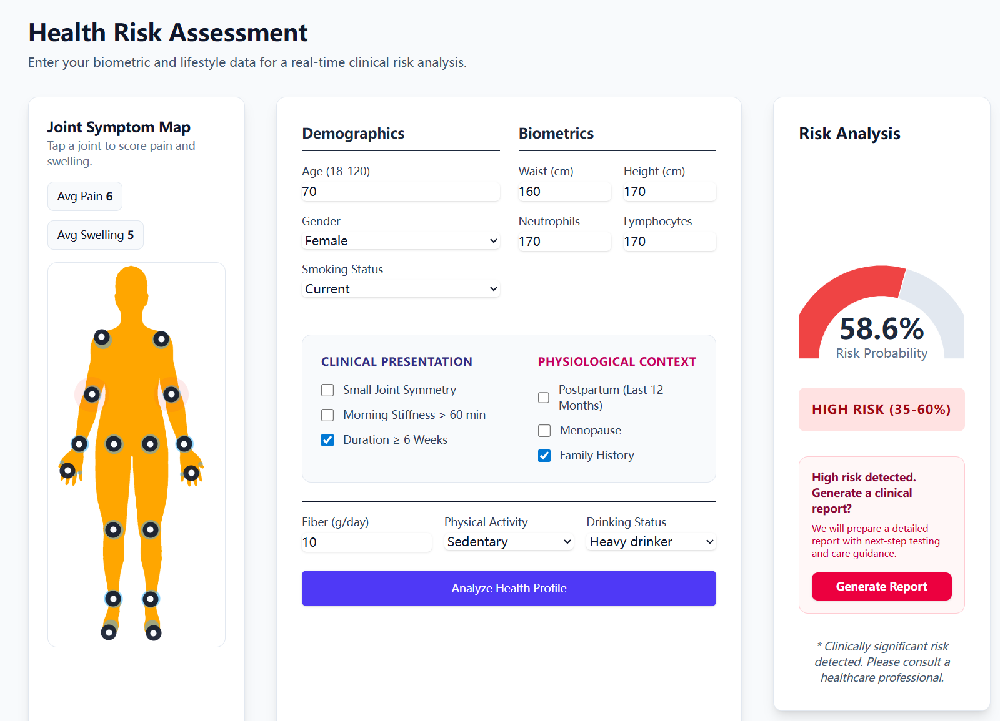
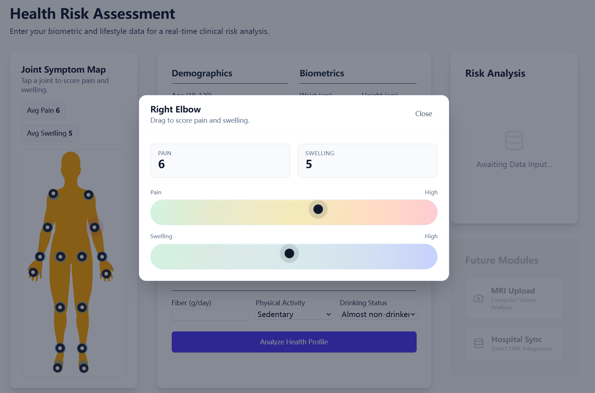

# healthXher Hackathon: RA Prediction & Management System

> **AuraRA** is an advanced, clinical-grade medical inference engine dedicated to the prediction, risk assessment, and management of Rheumatoid Arthritis (RA).

## 💡 About the Project & Product

AuraRA empowers healthcare professionals and researchers by providing a reliable tool for early RA detection and personalized risk management. 

By combining cutting-edge machine learning with comprehensive health survey data, our product acts as an intelligent decision-support system. It automatically evaluates clinical inputs and enforces strict biological constraints using "BioMatic Logic", ensuring that predictions are not only accurate but also clinically meaningful and logically sound.

### Key Features
- **Predictive Risk Modeling**: Leverages models trained on NHANES (National Health and Nutrition Examination Survey) data.
- **Clinically Validated Logic**: Employs "BioMatic Logic" to cross-check inputs and enforce health rules.
- **Secure, Local-First Architecture**: Features encrypted data storage to handle sensitive clinical data safely.
- **Modern Dashboard**: A streamlined, interactive user interface for seamless clinical data entry and risk visualization.

## 🖼️ Product Screenshots

<div align="center">
  
  
  <p><em>Figure 1: Main clinical dashboard overview (left) and Detailed symptoms records Analysis (right).</em></p>
</div>

---

## System Architecture

The project is structured as a full-stack application with a clear separation of concerns:

- **Frontend (`/frontend`):** A React + Vite SPA (Single Page Application) styled with Tailwind CSS, providing a dashboard for clinical data entry and risk visualization.
- **Backend (`/app`):** A FastAPI server providing a RESTful API, secured with JWT authentication and using SQLCipher for encrypted local-first data storage.
- **Python Models (`/python`):** The core machine learning pipeline, including model training, inference logic, and feature engineering.
- **Tests (`/tests`):** A comprehensive testing suite for both backend logic and model performance.

## Quick Start

### 1. Prerequisites
- Python 3.10+
- Node.js 18+

### 2. Environment Setup
Create a `.env` file or export the following variables:
```bash
export SECRET_KEY=$(openssl rand -hex 32)
export DB_PASSPHRASE=$(openssl rand -hex 32)
export DEFAULT_ADMIN_PASSWORD="ChooseAStrongPassword"
```

### 3. Backend Setup
```bash
# Create virtual environment
python -m venv venv
source venv/bin/activate  # or venv\Scripts\activate on Windows

# Install dependencies
pip install -r requirements.txt

# Start Server (Will automatically train/cache model on first run)
uvicorn app.main:app --reload --port 8000
```

### 4. Frontend Setup
```bash
cd frontend
npm install
npm run dev
```

The application will be available at `http://localhost:5173`.

## Security
This application uses **SQLCipher** for database encryption and **JWT (JSON Web Tokens)** for session management. All clinical data is handled locally and encrypted at rest.

## License
Proprietary - Research & Clinical Use Only.
