# healthXher Technical Architecture Report

## 1. Project Overview
**healthXher** is a Local-First Rheumatoid Arthritis (RA) Risk Prediction System. By combining clinical medical knowledge ("BioMatic Logic") with machine learning algorithms, the system provides users with RA risk assessments using non-invasive clinical indicators and demographic characteristics.

## 2. System Architecture
The project adopts a decoupled frontend-backend architecture. The backend integrates a machine learning pipeline, and data storage uses an encrypted database to ensure privacy.

### Architecture Diagram

```mermaid
flowchart TD
    %% --- 样式定义 ---
    classDef client fill:#E3F2FD,stroke:#1E88E5,stroke-width:2px,color:#0D47A1,rx:10,ry:10;
    classDef server fill:#F3E5F5,stroke:#8E24AA,stroke-width:2px,color:#4A148C,rx:10,ry:10;
    classDef ml fill:#E0F2F1,stroke:#00897B,stroke-width:2px,color:#004D40,stroke-dasharray: 5 5,rx:5,ry:5;
    classDef data fill:#FFF3E0,stroke:#E65100,stroke-width:3px,color:#E65100;

    %% --- 图表内容定义 ---
    subgraph Client ["💻 <b>Client Side</b>"]
        UI["⚛️ React SPA (Vite)"]
        AuthComp["🛡️ Auth Module"]
        Dashboard["📊 Dashboard & Risk Viz"]
        Form["📝 Clinical Data Entry"]
        
        %% 技巧1：用隐形连线强制前端四个组件横向对齐
        UI ~~~ AuthComp ~~~ Dashboard ~~~ Form
    end

    subgraph Server ["⚙️ <b>Server Side</b> "]
        API["🖧 API Gateway (FastAPI)"]
        
        AuthService["🔑 Auth Service (JWT)"]
        PredictService["🩺 Prediction Service"]
        
        DB_Interface["🧩 SQLAlchemy ORM"]
        
        subgraph ML_Core ["🧠 <b>ML Core</b>"]
            Pipeline["⚙️ RA Pipeline"]
            FeatEng["🔬 Feature Eng<br/>(NLR, BRI, DII)"]
            Model["🤖 Trained Model<br/>(GBDT/LR)"]
            
            Pipeline --> FeatEng ===>|Load / Inference| Model
        end
        
        %% 技巧2：强制鉴权服务和预测服务在同一水平高度
        AuthService ~~~ PredictService
        
        %% 技巧3：强制数据库ORM接口和ML Pipeline入口在同一水平高度，平衡左右视觉
        DB_Interface ~~~ Pipeline
    end

    subgraph Data ["🔒 <b>Data Storage</b>"]
        SQLite[("🗄️ SQLCipher Encrypted DB")]
    end

    %% --- 实际业务连线 ---
    UI == "HTTPS / JSON" ==> API
    
    API -.->|Verify Token| AuthService
    API -->|Risk Req| PredictService
    
    AuthService --> DB_Interface
    PredictService --> DB_Interface
    
    PredictService ==>|Patient Data| Pipeline
    
    DB_Interface --> SQLite

    %% --- 应用样式 ---
    class UI,AuthComp,Dashboard,Form client;
    class API,AuthService,PredictService,DB_Interface server;
    class Pipeline,FeatEng,Model ml;
    class SQLite data;
```

## 3. Technology Stack

### Frontend
*   **Framework**: React (Built with Vite)
*   **Styling**: Tailwind CSS
*   **Key Components**:
    *   `Dashboard`: Risk visualization display
    *   `DominantForm`: Dynamic health profile entry
    *   `Recharts`: Used for chart visualization
*   **Communication**: Axios (REST API Client)

### Backend
*   **Framework**: FastAPI (Python)
*   **Server**: Uvicorn
*   **Authentication**: JWT (JSON Web Tokens), Argon2 secure hashing
*   **ORM**: SQLAlchemy
*   **API Documentation**: OpenAPI / Swagger UI (Auto-generated)

### Data Storage
*   **Database**: SQLite (Supports SQLCipher encryption extension)
*   **Data Models**:
    *   `User`: User accounts and credentials
    *   `PredictionRecord`: Historical prediction records and input data

### Machine Learning
*   **Core Libraries**: Scikit-learn, XGBoost, Pandas, NumPy
*   **Algorithms**: Gradient Boosting Decision Trees (GBDT), Logistic Regression
*   **BioMatic Logic**:
    *   **Monotonic Constraints**: Ensures the model aligns with medical common sense (e.g., increased age increases risk).
    *   **Interaction Constraints**: Defines biological interactions between features.
    *   **Derived Features**: Automatically calculates BRI (Body Roundness Index), NLR (Neutrophil-to-Lymphocyte Ratio), etc.
    *   **Calibration**: Uses `CalibratedClassifierCV` for probability calibration.

## 4. Core Functional Modules

1.  **Secure Authentication Module**:
    *   Supports user registration and login.
    *   Passwords stored using Argon2 strong hashing.
    *   Bearer Token-based API access control.

2.  **RA Prediction Pipeline (v2.0)**:
    *   **Feature Engineering**: Automatically handles missing values and calculates complex medical indices.
    *   **Weighting Mechanism**: Introduces NHANES multi-cycle weight adjustments.
    *   **Model Interpretation**: Outputs risk probability and risk levels.

3.  **Clinical Dashboard**:
    *   Visual display of prediction results.
    *   Provides form-based interactive data input.

## 5. Project Structure Overview

*   `app/`: Backend core code (API, Models, Services).
*   `frontend/`: Frontend React application source code.
*   `python/`: Machine learning training scripts and pipeline definition (`ra_pipeline.py`).
*   `doc/`: Project documentation and implementation plans.
*   `scripts/`: Auxiliary scripts (e.g., model training).

---
**Generated Date**: 2026-02-21
**Version**: v1.0